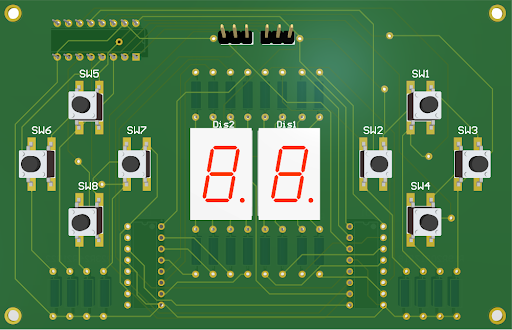

PCB Files for the two pcbs we created to accomplish this project

First PCB folder is for the solenoid Driver, which powers and controls the solenoids activation.
Second PCB folder is for the custom made controller, which allows user input and score display.

