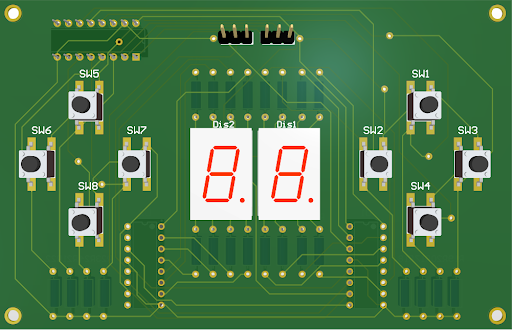

# Solenoid-Pong-Game
Using solenoids as a screen display, we made a game of pong that is playable with two custom made controllers 

## Youtube Video Demo Link

## 3D Files
All the 3D STL files are located in the 3D STL folder

## PCB Files
All the PCB gerber files are located within the PCB files folder

